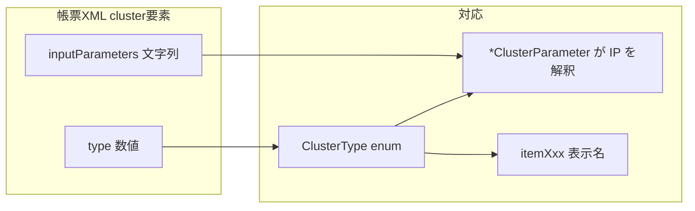

# クラスタ種別・表示名・inputParameters — 外部開発者向け統合リファレンス

ConMas 帳票 XML や API を扱う **外部開発者**向けに、次の対応関係を1表にまとめたものです。

| 概念 | 格納場所・形式 |
|------|----------------|
| **種別 ID** | XML `<cluster><type>` の数値 = `ClusterType` 列挙子（[`ClusterType.cs`](../../LibConMas/ImageDb/ClusterType.cs)） |
| **画面上の種別名** | Designer / クライアントの言語リソース（日本語: [`iReporter.Language.xml`](../../ConMasClient/iReporter.Language.xml) の `item*` 要素）。英語: [`iReporter.Language@English.xml`](../../ConMasClient/iReporter.Language@English.xml) |
| **細かい設定** | 同一 `<cluster>` 内の `<inputParameters>` 本文（`key=value;...`）= C# `BlankCluster.InputParameter`。意味は **種別ごとに異なる**（実装クラスは [`input-parameters.md`](input-parameters.md) の索引表） |

**関連ドキュメント**

- [input-parameters.md](input-parameters.md) — `inputParameters` の共通形式・型別キー・`stDefaults` 索引
- [input-parameters-ui-labels.md](input-parameters-ui-labels.md) — **キーと画面上の日本語名称**の対応（共通ラベル・画像/録音の例・Action 全キー一覧）
- [input-parameters-ui-labels-coverage-plan.md](input-parameters-ui-labels-coverage-plan.md) — **全 38 型網羅**のタスク・検証ルール（正確性重視）
- [cluster-types-reference.md](cluster-types-reference.md) — MVP スコープ等の簡易一覧
- [xml-schema-summary.md](xml-schema-summary.md) — XML 全体構造

---

## 統合一覧（主要クラスタ型）

`ClusterParameter.ToClusterParameter` に **具象が存在する**型について、`stDefaults` インデックス（デフォルト文字列配列の番号）と、表示名・実装クラスを対応づけています。

| `ClusterType` | 値 | 日本語表示名（`iReporter.Language.xml`） | English（`iReporter.Language@English.xml`） | stDefaults | 入力パラメータ実装クラス（`LibConMas/ImageDb` 等） |
|---------------|-----|---------------------------------------------|---------------------------------------------|------------|--------------------------------------------------|
| KeyboardText | 30 | キーボードテキスト | Keyboard | [0] | `KeyboardTextClusterParameter`（Domain 層・ParameterMapper） |
| Handwriting | 119 | 手書きデジタル | Text by handwriting | [1] | `HandwritingClusterParameter` |
| FixedText | 20 | 手書きノート形式 | Handwriting note | [2] | `FixedTextClusterParameter` |
| FreeText | 10 | 手書きフリーメモ | Free whiteboard | [3] | `FreeTextClusterParameter` |
| Numeric | 60 | 数値選択 | Choice of Numerical number | [4] | `NumericClusterParameter` |
| InputNumeric | 65 | 数値 | Numerical number keyboard | [5] | `InputNumericClusterParameter` |
| NumberHours | 110 | 時間数 | Number of hours | [6] | `NumberHoursClusterParameter` |
| Calculate | 67 | 計算式 | Calculation formula | [7] | `CalculateClusterParameter` |
| Date | 40 | 年月日 | Date | [8] | `DateClusterParameter` |
| CalendarDate | 111 | カレンダー年月日 | Calendar | [9] | `CalendarDateClusterParameter` |
| Time | 50 | 時刻 | Time | [10] | `TimeClusterParameter` |
| Check | 90 | チェック | Single check | [11] | `CheckClusterParameter` |
| MultipleChoiceNumber | 123 | トグル選択 | Toggle select | [12] | `MultipleChoiceNumberParameter` |
| MCNCalculate | 124 | トグル集計 | Toggle summary | [13] | `MCNCalculateParameter` |
| Select | 70 | 単一選択 | Single choice | [14] | `SelectClusterParameter` |
| MultiSelect | 80 | 複数選択 | Multiple choice | [15] | `MultiSelectClusterParameter` |
| Image | 100 | 画像 | Image | [16] | `ImageClusterParameter` |
| Create | 116 | 作成 | Issuer | [17] | `CreateClusterParameter` |
| Inspect | 117 | 査閲 | Inspector | [18] | `InspectClusterParameter` |
| Approve | 118 | 承認 | Approver | [19] | `ApproveClusterParameter` |
| Registration | 112 | 帳票登録者 | Issuer of document | [20] | `RegistrationClusterParameter` |
| RegistrationDate | 113 | 帳票登録年月日 | Date of issue | [21] | `RegistrationDateClusterParameter` |
| LatestUpdate | 114 | 帳票更新者 | Last update person | [22] | `LatestUpdateClusterParameter` |
| LatestUpdateDate | 115 | 帳票更新年月日 | Last update date | [23] | `LatestUpdateDateClusterParameter` |
| QRCode | 121 | バーコード | Bar code | [24] | `QRCodeClusterParameter` |
| CodeReader | 122 | コードリーダー | Barcode reader | [25] | `CodeReaderClusterParameter` |
| Gps | 120 | GPS位置情報 | GPS location | [26] | `GpsClusterParameter` |
| FreeDraw | 15 | フリードロー | Free draw | [27] | `FreeDrawClusterParameter` |
| TimeCalculate | 55 | 時刻計算 | Time calculation | [28] | `TimeCalculateClusterParameter` |
| SelectMaster | 125 | マスター選択 | Select master | [29] | `SelectMasterClusterParameter` |
| Action | 126 | アクション | Action | [30] | `ActionClusterParameter` |
| LoginUser | 127 | ログインユーザー | Log-in user | [31] | `LoginUserClusterParameter` |
| DrawingImage | 128 | ピン打ち | Stick pins | [32] | `DrawingImageClusterParameter` |
| DrawingPinNo | 129 | ピンNo.配置 | Pin No. locating | [33] | `DrawingPinNoClusterParameter` |
| PinItemTableNo | 130 | ピンNo. | Pin No. | [34] | `PinItemTableNoClusterParameter` |
| AudioRecording | 131 | 録音 | Audio recording | [35] | `AudioRecordingClusterParameter` |
| Scandit | 132 | SCANDIT | SCANDIT | [36] | `ScanditClusterParameter` |
| EdgeOCR | 133 | EdgeOCR | EdgeOCR | [37] | `EdgeOCRClusterParameter` |

- 表示名のソースキーは `item` + 列挙子名（例: `KeyboardText` → `itemKeyboardText`）です。
- 中国語など他言語は `iReporter.Language@China.xml` 等を参照してください。

---

## その他の `ClusterType`（上表外）

次の値は `ClusterType` には存在しますが、**上記の `item*` 一覧には含まれません**（専用画面・別リソース・または限定的用途）。`inputParameters` の一般的な `ClusterParameter` 分岐対象外の型もあります。

| `ClusterType` | 値 | 備考 |
|---------------|-----|------|
| IfFunction | 150 | 条件分岐 |
| OmrCheck | 200 | OMR |
| OmrQr | 210 | OMR |
| Table | 300 | テーブル |
| BusinessCard | 310 | 名刺 |
| TeninQr / TeninCheck | 500 / 501 | カスタマイズ用 |
| Mask | 900 | マスク |
| Unknown | 999 | 不明 |

詳細なキー仕様が必要な場合は、該当モジュールのコードまたは Designer が出力する XML を参照してください。

---

## inputParameters を読むときの手順（外部ツール向け）

1. `<type>` の整数から `ClusterType` を特定する。
2. [input-parameters.md](input-parameters.md) の **§3 索引表** で `*ClusterParameter` クラス名を確認する。
3. 文字列を `key=value;...` としてパースする（`;;` とセミコロンのルールは [input-parameters.md §2](input-parameters.md)）。
4. 手動パース型は、対応する `*ClusterParameter.cs` 先頭の `Item*` 定数がキー名の一覧になる。

---

## 更新履歴

| 日付 | 内容 |
|------|------|
| 2026-03-28 | 初版 — 種別・表示名・`inputParameters` 実装の統合表 |
